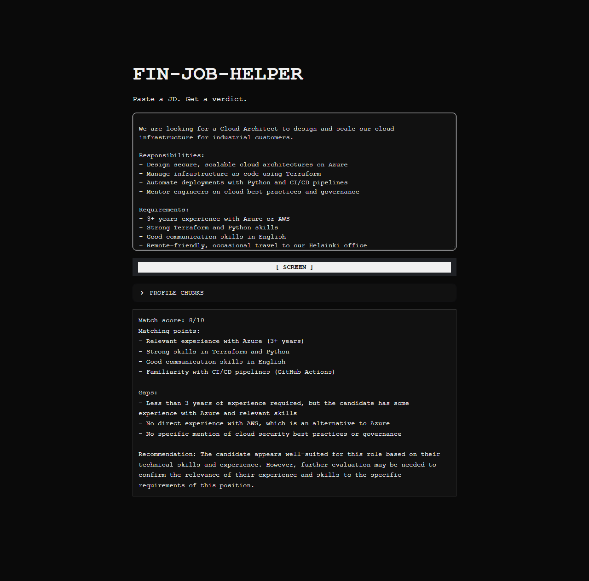

# fin-job-helper
Agentic job-search assistant: RAG + hybrid rule/LLM screening + tool calling, built for the Finnish AI/cloud job market.



## Setup
```
pip install -r requirements.txt
ollama pull llama3.2
```

See [FINDINGS.md](FINDINGS.md) for the testing notes and design rationale behind each version, from V1's model-reliability issues through the V2 rule layer, V3's RAG architecture, and the V3.5 UI rationale.

## How to use

**Web UI (recommended):**
```
streamlit run app.py
```
Open http://localhost:8501, paste a JD, click `[ SCREEN ]`.

**Terminal:**
```
python analyzer.py
```
Paste a job description, type `END` on a new line, and press Enter.

Both interfaces run the same checks: Finnish-language requirement detection first (rule-based, no model call; hard stop if required, notice if mentioned as a nice-to-have), then RAG retrieval of the most relevant profile chunks, a match score and recommendation, and every judgment saved to `history.json` (local only, gitignored).

**Note:** The candidate profile in `profile.py` and the ChromaDB index in `chroma_db/` are personalised to the author. To use this tool for your own job search, update `profile.py` with your own background and re-run `python build_profile_db.py` to rebuild the index.

## Progress

- [x] Step 0 — confirm Ollama runs locally
- [x] V1 step 1 — `test_ollama.py`: send hardcoded text to Ollama, print reply
- [x] V1 step 2 — `profile.py`: candidate background as a reusable variable
- [x] V1 step 3 — `analyzer.py`: accept a pasted JD via terminal input
- [x] V1 step 4 — build the combined prompt (profile + JD + output format)
- [x] V1 step 5 — tune the prompt until output format is stable
- [x] V1 step 6 — tested against a real job description; confirmed the model is unreliable at detecting explicit Finnish-language requirements, motivating the V2 rule-based layer
- [x] V2 step 1 — `finnish_detector.py`: keyword scan for Finnish requirements, separates hard requirement from nice-to-have
- [x] V2 step 2 — Finnish detector wired into `analyzer.py`; runs before the model, hard stop exits without a model call
- [x] V2 step 3 — `history.py`: saves every judgment to `history.json` (gitignored)
- [x] V3 step 1 — `build_profile_db.py`: chunk profile into ChromaDB vector index
- [x] V3 step 2 — `retriever.py`: semantic chunk retrieval against JD
- [x] V3 step 3 — RAG wired into `analyzer.py`; model now sees only the most relevant profile chunks
- [x] V3 fix — negation handling in `finnish_detector.py` ("No Finnish required" no longer false-positives)
- [x] V3.5 — Streamlit web UI with terminal aesthetic (`app.py`)
- [x] V3.5 fix — UI polish: expander icon font, label clipping, profile-chunk font-size consistency, verdict line wrapping (no horizontal scroll)
- [ ] V4 — agent + tool calling (fetch JD by URL, draft cover letter)
- [ ] V5 — evaluation harness + observability
